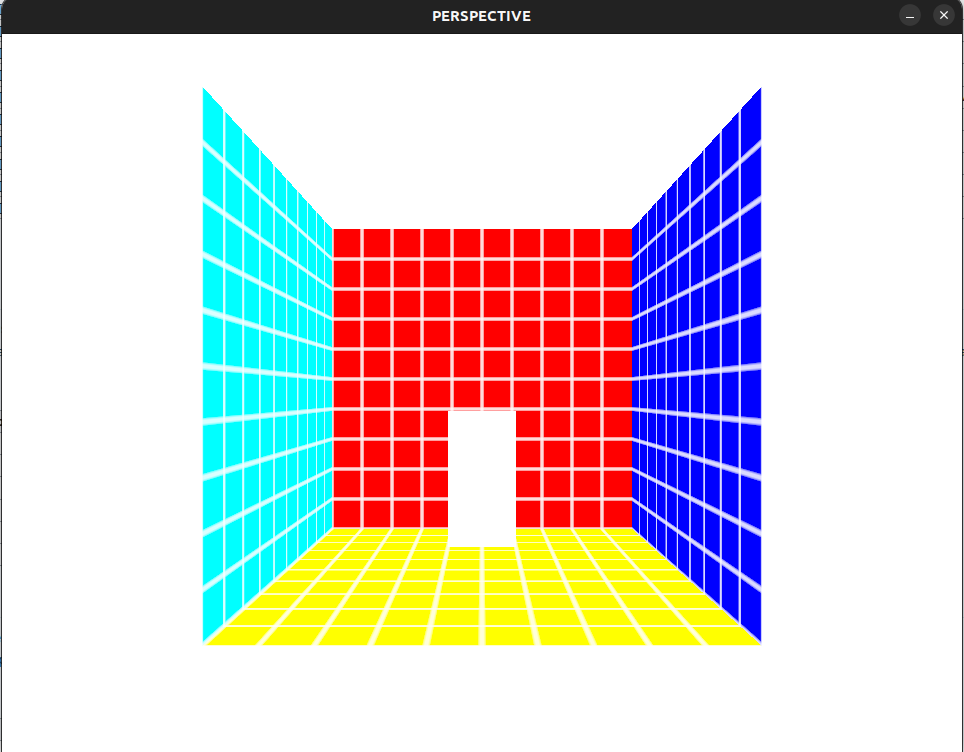

# 3D in Love2d
There seems to be a lack of end to end resources for applying a perspective matrix in Love2d. Hope this repo helps those who are interested in integrating 3d elements into their 2d games.




## The minimal 3D Shader
With the introduction of love v11 we can now implement full 3d scenes in love without modifying the binary. All we have to do is define a vertex shader and replace the default transform_projection with our own. This replaces the default orthographic projection used by love2d with a perspective projection when the vertex shader is active. Note that we also have to pass in the transform, as the transform data passed in by love2d by default is already multiplied by the orthographic projection.

``` fennel
(local vshader  "
uniform mat4 projection;
uniform mat4 transform;
uniform mat4 view;
vec4 position(mat4 transform_projection, vec4 vertex_position)
{
    return  projection * view * transform * vertex_position;
}
")
```

## Defining a 3D Vertex Format
By default, love2d passes in 2d vector coordinates to the shader. Despite this the shader still expects a `vec4`. The `z` and `w` values are simply mapped to 0 and 1 respectively. The change this default behaviour we need to define a custom vertex-format to expect 4 floats rather than 2.

``` fennel
(local vertex-format
       [["VertexPosition" :float 4]
        ["VertexTexCoord" :float 2]])
```

The VertexTexCoord is referenced in the pixel (fragment) shader via the 3rd argument to the `effect` function, which is by default `vec2 texture_coords`. It's used to index the texture associated with the fragment being drawn.

``` fennel
(local pshader "
vec4 effect(vec4 color, Image tex, vec2 texture_coords, vec2 screen_coords)
{
    vec4 texturecolor = Texel(tex, texture_coords);
    return texturecolor * color;
}
")
```

We could also pass in colour information by including an additional table in `vertex-format` `["VertexColor" :byte 4]`. In this example we are not working with colours so it has been excluded.

For an exhaustive list of available shader variables check out [Love2D Shader Variables](https://love2d.org/wiki/Shader_Variables)

When you create a new mesh, pass in the vertex format as the first argument to `love.graphics.newMesh`. Note, throughout this project I use `lg` in place of `love.graphics`.

``` fennel
;; vertex format = [x y z w ux uy]
(local verticies [[0   0   0 1 0 0]
                  [100 0   0 1 1 0]
                  [100 100 0 1 1 1]
                  [0   100 0 1 0 1]])
(local mesh (lg.newMesh vertex-format vertices :fan :static))
```

## Setting the Perspective Shader
Once you've defined a vertex shader that takes a perspective projection matrix you can make a love2d shader using `love.graphics.newShader`. You can pass in a pixel (fragment) shader, a vertex shader, both or a single shader with both a vertex and a fragment portion. Note if you want to pass in a single shader with both a pixel and fragment portion they have to be separated with ifdefs.

``` fennel
(local shader (lg.newShader pshader vshader))
```

To pass in uniforms (values like projection / transform used by the shader), can use the `shader:send` method.

``` fennel
(shader:send :projection projection)
(shader:send :view view-matrix)
(shader:send :transform transform)
```

## Defining a Depth Canvas
By default draw calls overwrite pixels already drawn on the active canvas. This behaviour can be modified by having a depth "buffer". In love2d your depth buffer is just a canvas with a specific [pixel format](https://love2d.org/wiki/PixelFormat). In this example i will be using the depth format `depth24`, you can choose any other valid depth format that suits your needs.

``` fennel
(local depth-image (lg.newCanvas w h {:format :depth24 :readable true}))
```

Before you draw a 3d scene you have to set the appropriate `depth-stencil` canvas. This does not change the canvas that is being drawn to, it just changes the canvas that is being used by depth testing.

``` fennel
(lg.setCanvas {:depth-stencil depth-image})
```

By default the depth test mode is set to `always`, meaning a pixel will be drawn regardless of its distance. This defeats the purpose of having a depth buffer. To change this behaviour to only draw pixels that are close to the camera you can set the depth buffer test to less.

``` fennel
(lg.setDepthMode :less true)
```

Do this before you start drawing your 3d scene.

If you want a draw call to overwrite pixels that appear in from of it you can set the depth mode back to always.

## The Transform, View and Projection Matrices
With the implementation of the 3d vertex format and the depth buffer we can draw a 3d scene by passing in meshes with 3d verticies. This scene will be drawn orthographically, i.e. without perspective. If you refer to the vertex shader you can see that there were several `mat4`s that it was expecting: transform, view and projection.

Transform moves vertices to their location in world space, view reorients world space so it is facing the "camera" and projection takes that vertex from the eye of the camera and puts it into a 3d volume that opengl expects. By default love2d simply has the transform for the object, and an orthographic projection. We want to re-implement the transform, add a view matrix and use a perspective projection matrix rather than an orthographic projection matrix


The model transform matrix applies a translation, scale and rotation to a vec4 vertex. Each of these steps can be performed as a separate operation, or a single matrix can be constructed that performs all three actions. Below is an example of a model transform matrix that performs all three transformations in one matrix multiplication. 
```
(fn model-transform [translation scale rotation]
  (local {: cos : sin} math)
  (let [c3 (cos (. rotation 3))
        s3 (sin (. rotation 3))
        c2 (cos (. rotation 1))
        s2 (sin (. rotation 1))
        c1 (cos (. rotation 2))
        s1 (sin (. rotation 2))
        sx (. scale 1)
        sy (or (. scale 2) sx)
        sz (or (. scale 3) sx)
        tx (. translation 1)
        ty (. translation 2)
        tz (. translation 3)]
    [(+ (* sx s1 s2 s3) (* sx c1 c3)) (- (* sy c3 s1 s2) (* sy c1 s3)) (* sz c2 s1)  tx
     (* sx c2 s3)                     (* sy c2 c3)                     (- (* sz s2)) ty
     (- (* sx c1 s2 s3) (* sx s1 c3)) (+ (* sy c1 c3 s2) (* sy s1 s3)) (* sz c1 c2)  tz
     0                                0                                0             1.0
     ]))
```

The view matrix is similar to the model transform matrix, minus the scaling. To find a view matrix you need the position you would like to view the world from, the orientation / direction in which you would like to see the world (which way you are facing) and a vector defining which way is up. The vector defining which way is up will be dependent on the orientation used by the perspective matrix below. Here I use the cross products of the normalized position direction and up vectors to determine the rotation and the dot product to determine the translation.

```
(fn view-direction [position direction up?]
  (local up-default [0 -1 0])
  (let [up (or up? up-default)
        w (vec3.normalize direction)
        u (vec3.normalize (vec3.cross w up))
        v (vec3.cross w u)
        nw (- (vec3.dot w position))
        nu (- (vec3.dot u position))
        nv (- (vec3.dot v position))]
    [(. u 1) (. u 2) (. u 3) nu
     (. v 1) (. v 2) (. v 3) nv
     (. w 1) (. w 2) (. w 3) nw
     0 0 0 1]
    ))
```

The perspective matrix is what gives your scene depth. You will need to have a y field of view the aspect ratio of the window (W/H) a near clipping plane (greater than 0) and a far clipping plane. In theory your far clipping plane could be infinite.

Note this is the right hand zo perspective matrix. I should be using the left hand zo matrix for compatibility with love2d. In the example you will notice that the controls when the perspective matrix is applied is inverted with the orthographic matrix is applied. Check out the glm library for the lhzo perspective matrix.

```
(fn perspective-rhzo! [_ fov aspect near far]
  (local f  (math.tan (* (/ fov 2)) (/ 180 math.pi)))
  [ (/ 1 (* f aspect)) 0 0 0
    0  (/ 1 f) 0 0
    0 0 (/ far (- near far)) -1
    0 0 (- (/ (* far near) (- far near))) 0
    ]
  )

```

## Putting it together
Lets put it all together, assuming you have the shader and mesh as defined above we simply need to define our matrices set up our shader and depth canvas and we can draw a 3d scene. 

I define my perspective matrix outside of my draw loop since the only times you would need to change this matrix is when the screen size changes (or if you want to update the field of view). 

The transform matrix can be updated per object per frame, and the view matrix applies to all objects and is updated each frame. If you are using a fixed "camera" position you can move the view-matrix definition out of the `draw` or `update` loops.

Don't forget to send the matrices to the shader. If the uniforms defined in the vertex shader do not match what is sent you will get an error.


``` fennel
(local perspective 
  (perspective-rhzo!
    nil
    45
    (/ 960 720)
    1
    1000))
  
(fn love.draw [obj]
  (lg.push :all)
  (local transform (model-transform [0 0 0] [1] [0  0  0]))
  (local view-matrix (view-direction [0 0 0] [0 0 1] [0 1 0]))
  (lg.setCanvas {:depth-stencil depth-image})
  (lg.setShader shader)
  (shader:send :projection projection)
  (shader:send :view view-matrix)
  (shader:send :transform transform)
  (lg.setDepthMode :less true)
  (lg.draw mesh)
  (lg.pop))
```
